# Standalone konzolos alkalmazás:

#
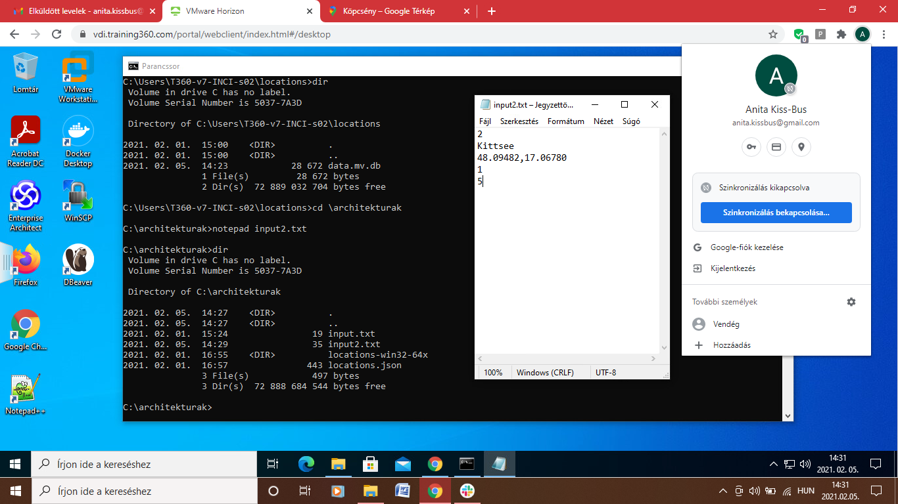
#
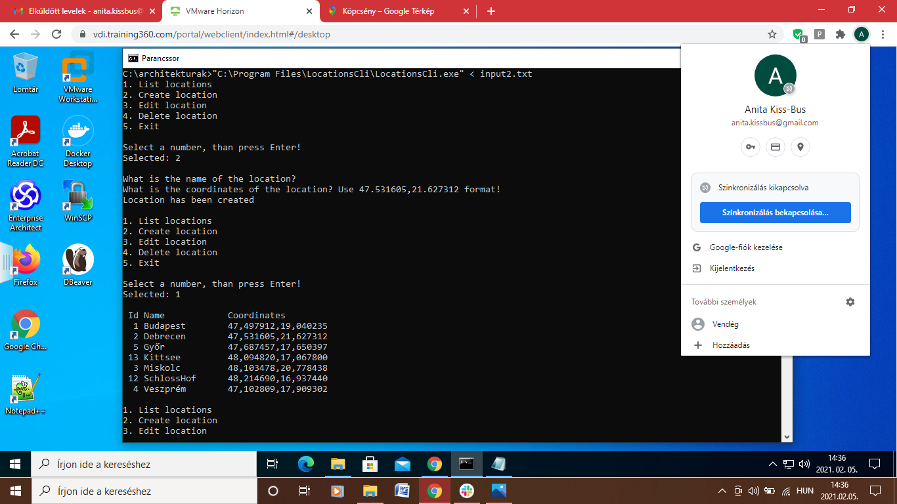

# Standalone alkalmazás grafikus felülettel:

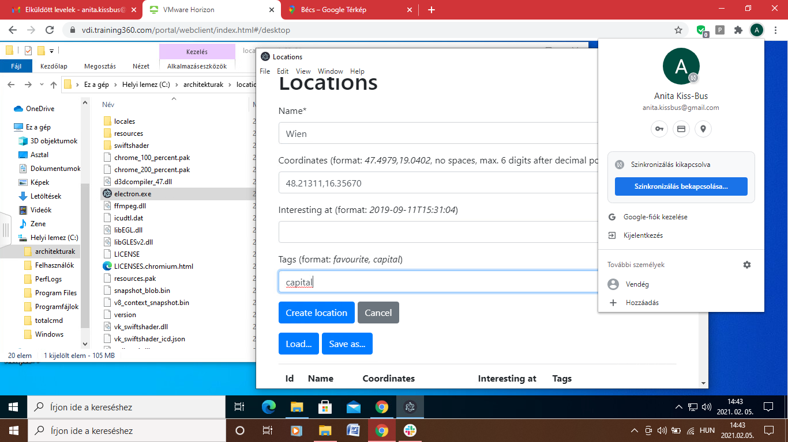
#
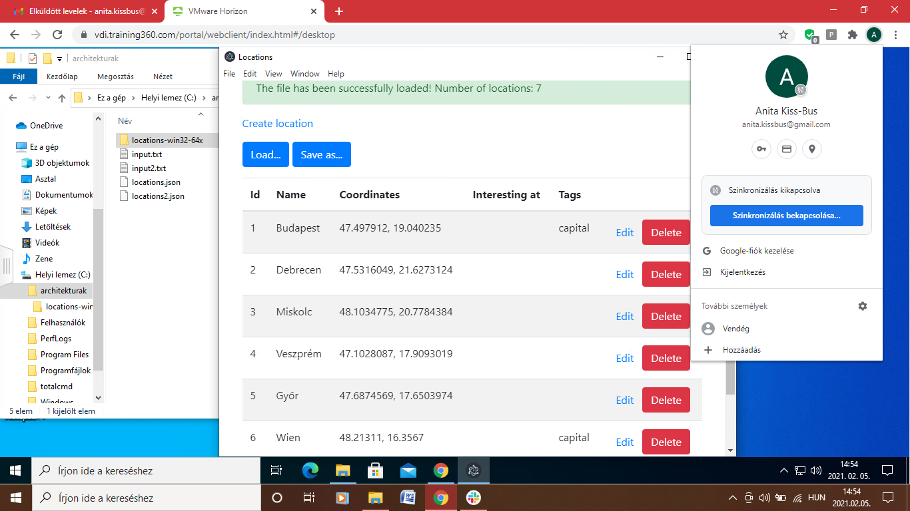

# Központi adatbázis:

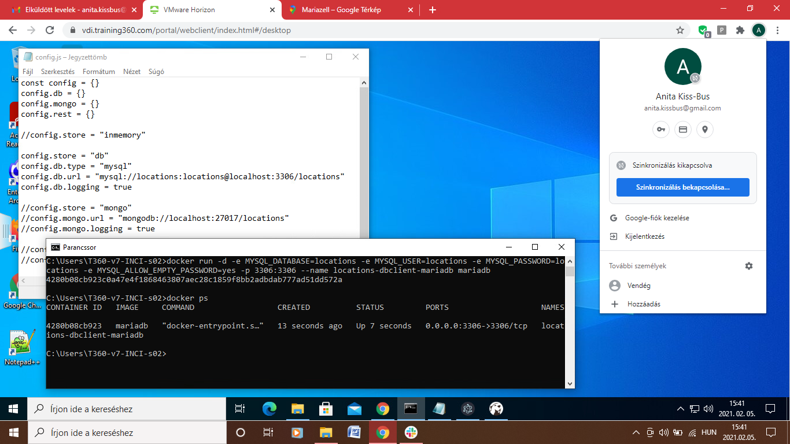
#
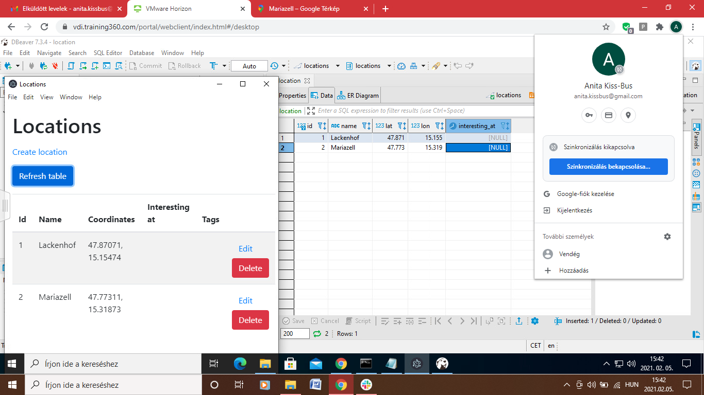

# SQL nyelv:

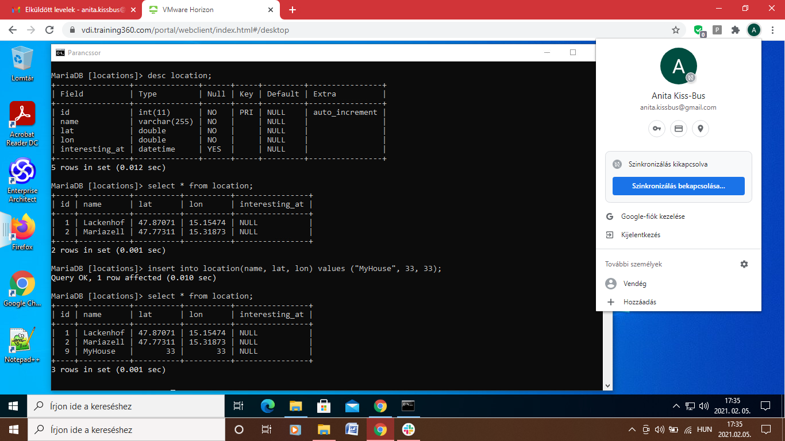
#

#
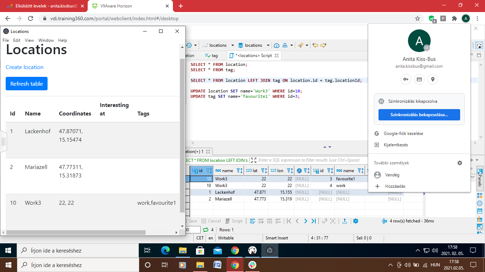

# NOSQL adatbázisok:

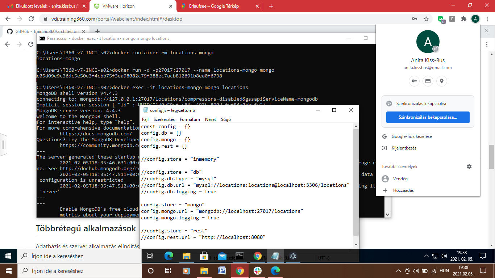
#
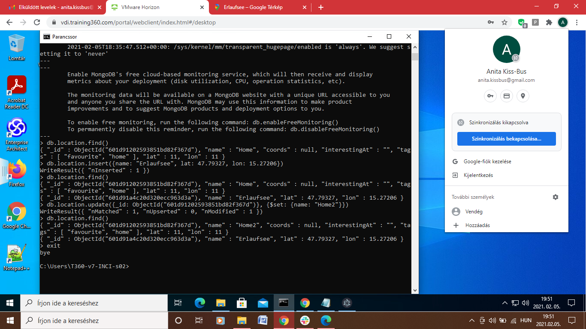

# Többrétegű alkalmazások:

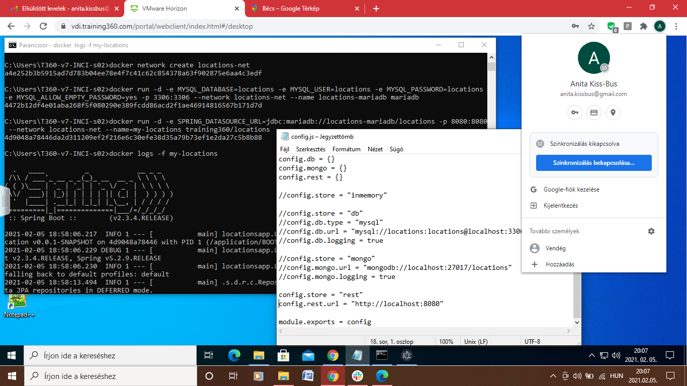
#
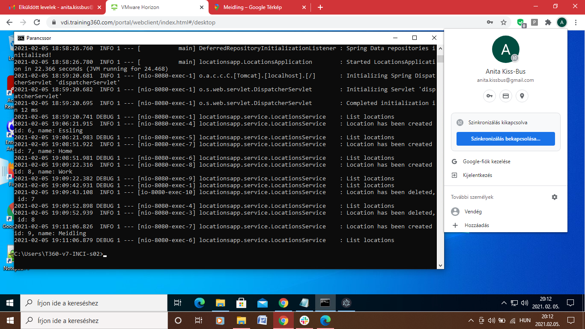

# Webes alkalmazás:

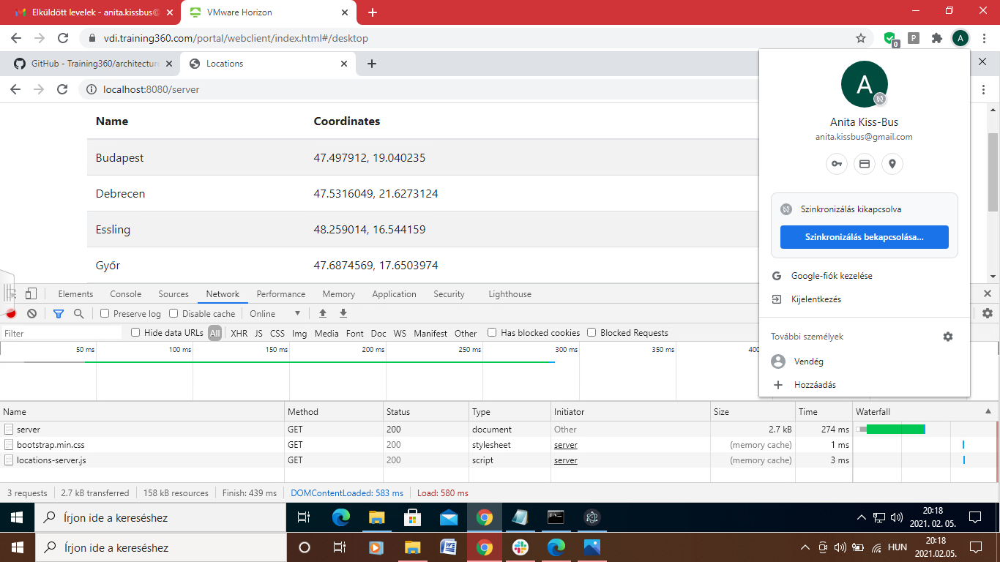
#
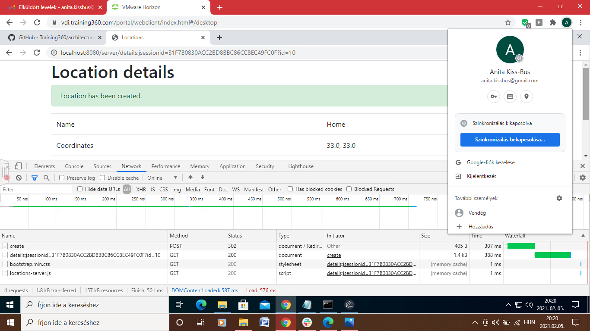
#
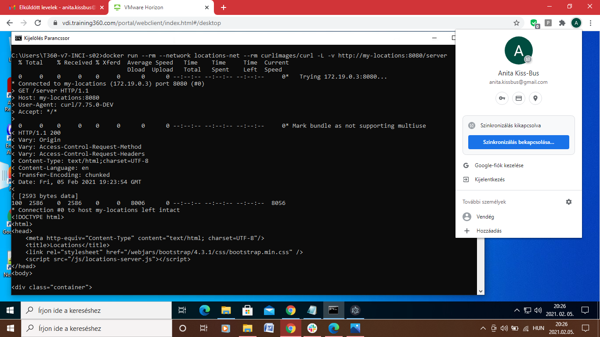

# Web formátumai: HTML és CSS

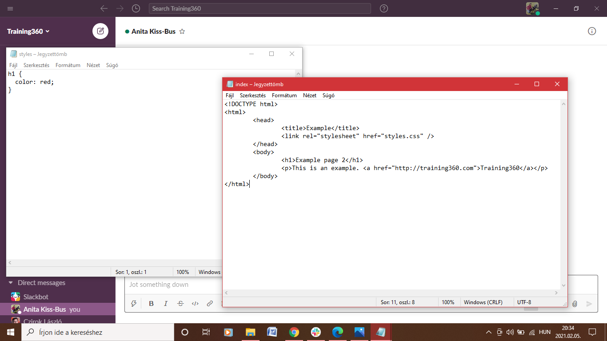
#
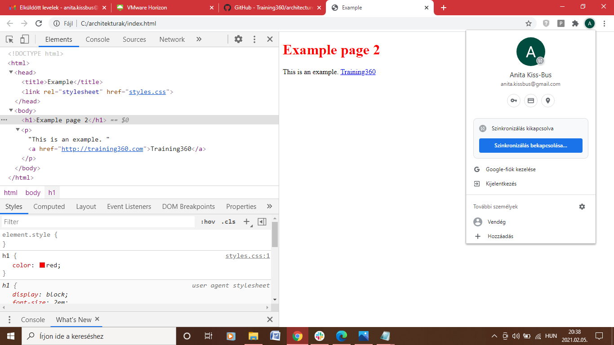

