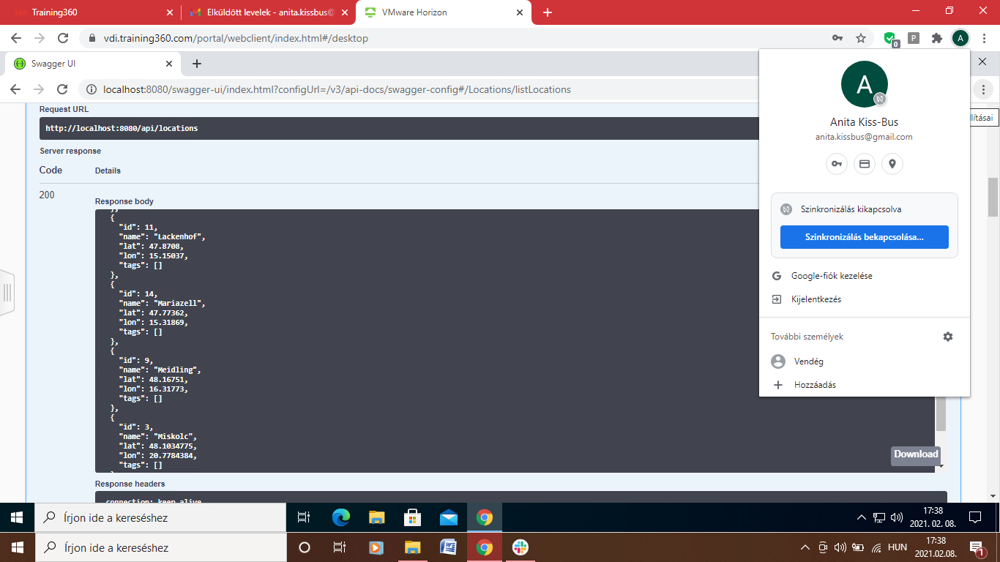
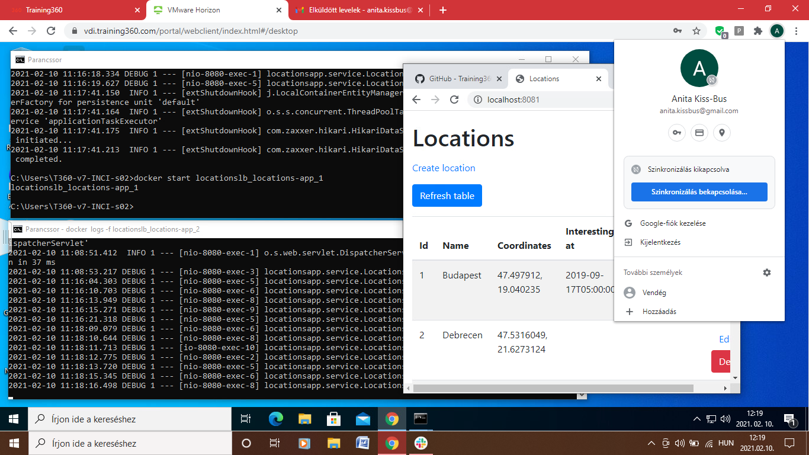

# Standalone konzolos alkalmazás:

# Standalone alkalmazás grafikus felülettel:

# Központi adatbázis:

# SQL nyelv:

# NOSQL adatbázisok:

# Többrétegű alkalmazások:

# Webes alkalmazás:

# Web formátumai - HTML és CSS:

# Webes alkalmazás RIA felülettel - Javascript:

# Webes alkalmazás RIA felülettel - webes alkalmazás:

# REST webszolgáltatások - Swagger:

# REST webszolgáltatások - Postman:

# Szerver alkalmazás webszolgáltatás interfésszel - SOAP:

# Magas rendelkezésre állás és skálázhatóság:

# Virtualizáció:

