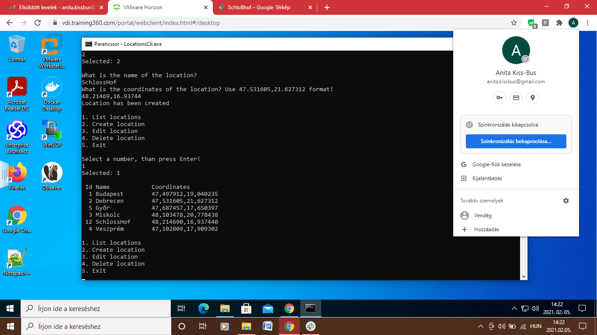

# Standalone konzolos alkalmazás:

#

#

# Standalone alkalmazás grafikus felülettel:

#

# Központi adatbázis:

#

# SQL nyelv:

#

#

# NOSQL adatbázisok:

#

# Többrétegű alkalmazások:

#

# Webes alkalmazás:

#

#

# Web formátumai: HTML és CSS

#

